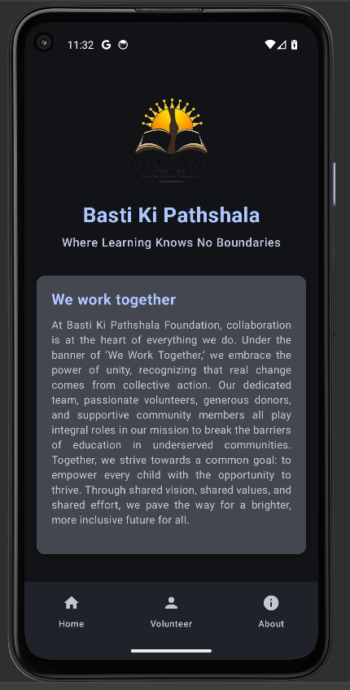
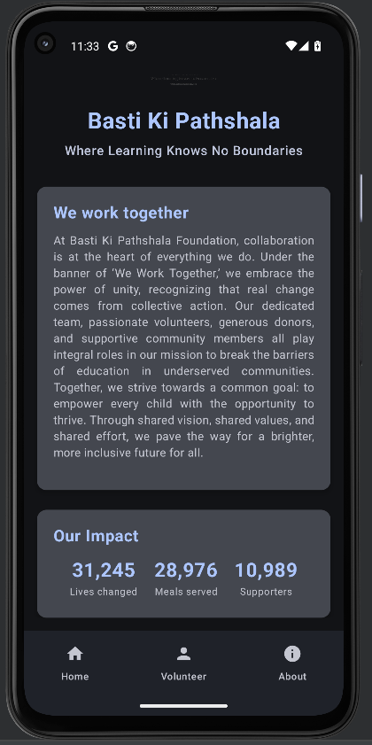
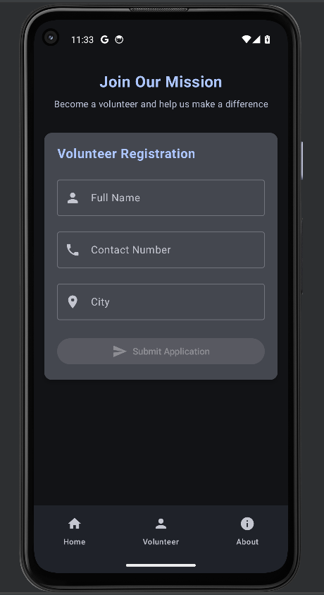
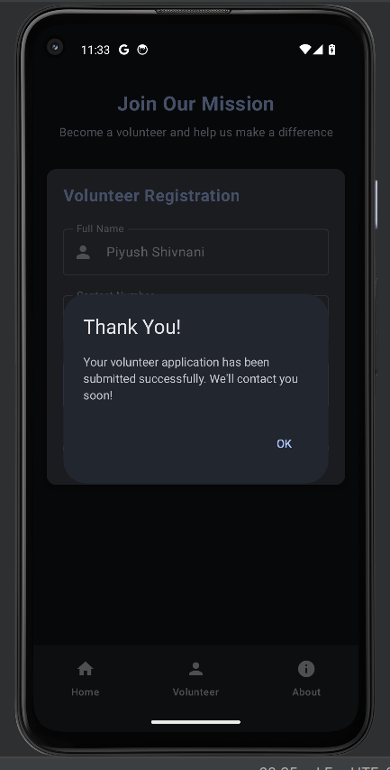
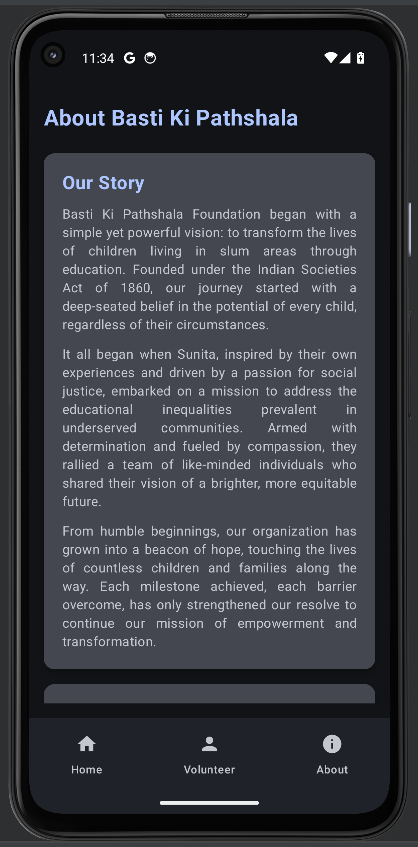
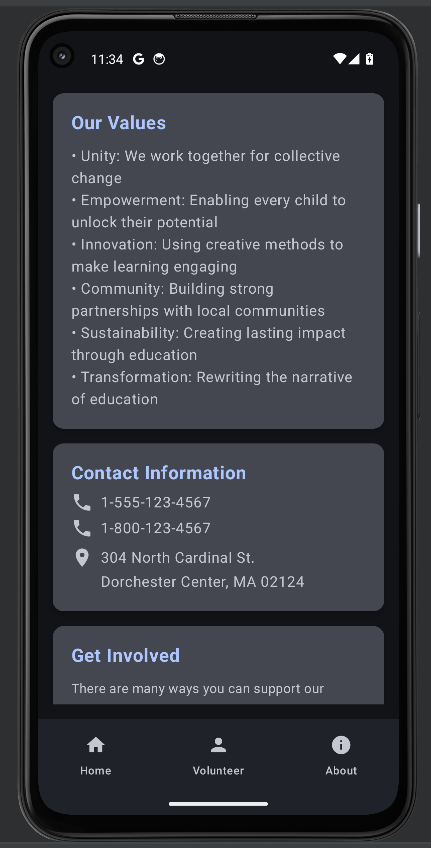

# Basti Ki Pathshala - NGO Android App

A modern Android application built with Jetpack Compose for **Basti Ki Pathshala Foundation**, an NGO dedicated to providing quality education to children in underserved communities.

## 📱 About the App

**Basti Ki Pathshala** (Where Learning Knows No Boundaries) is a comprehensive mobile application that showcases the foundation's mission, impact, and provides a platform for volunteer registration.

### 🎯 Key Features

- **Home Screen**: NGO branding, mission statement, and impact statistics
- **Volunteer Registration**: Form to collect volunteer information (name, contact, city)
- **About Us**: Complete foundation story, values, and contact information
- **Modern UI**: Built with Material Design 3 and Jetpack Compose
- **Responsive Design**: Optimized for various screen sizes

## 🏗️ Technical Stack

- **Language**: Kotlin
- **UI Framework**: Jetpack Compose
- **Architecture**: MVVM with Navigation Component
- **Minimum SDK**: API 24 (Android 7.0)
- **Target SDK**: API 35 (Android 15)
- **Build System**: Gradle with Kotlin DSL

## 📱 Screenshots

<table>
<tr>
<td></td>
<td></td>
<td></td>
</tr>
<tr>
<td></td>
<td></td>
<td></td>
</tr>
</table>

## 🎨 Design Features

- **Material Design 3**: Modern, accessible UI components
- **Dark/Light Theme Support**: Adaptive theming
- **Responsive Layout**: Works on phones and tablets
- **Accessibility**: Screen reader support and proper content descriptions
- **Smooth Navigation**: Bottom navigation with smooth transitions

### Dependencies
- **Navigation Compose**: 2.7.7
- **Material 3**: Latest from Compose BOM
- **Activity Compose**: 1.10.1
